# SafeClaw

[OpenClaw](https://openclaw.ai/) plugin that makes it safe to run OpenClaw on your everyday machine. Tool execution is routed to a [Validance](https://docs.validance.io/) instance (or any server that implements the contract) — gated by human approval, learned policies, and governance; recorded in a tamper-evident audit chain.

## Why this exists

SafeClaw adds safety, governance, and audit to an OpenClaw deployment: every action that would otherwise execute with OpenClaw's privileges is gated by human approval and learned policy, runs in an isolated container, and is recorded in a tamper-evident audit chain.

With SafeClaw enabled in OpenClaw:

- Native tools are denied via the OpenClaw config (see Quick start, step 2).
- SafeClaw re-exposes those capabilities as tools that route through Validance.
- Human-confirm actions surface in OpenClaw as inline `/sc-approve <id>` prompts.
- Trust profiles tune which actions auto-approve and which require confirmation.
- Gateway webhooks carry approval notifications from Validance back into OpenClaw.

## How it works



## What you need

- An [OpenClaw](https://openclaw.ai/) installation.
- A [Validance](https://docs.validance.io/) instance — local or remote. The default `kernelUrl` (`https://api.validance.io`) is Validance's hosted evaluation endpoint, open for pre-GA use without authentication. For local installation or production access, see [Validance — Getting started](https://docs.validance.io/getting-started/).

## Quick start

### 1. Install the plugin in OpenClaw

```bash
openclaw plugins install @validance/safeclaw
```

(Or `openclaw plugins install npm:@validance/safeclaw` to force resolution via npm.)

### 2. Configure OpenClaw

Add to your OpenClaw config:

```json
{
  "tools": {
    "deny": ["exec", "bash", "write", "edit", "apply_patch", "message",
             "sessions_send", "browser", "web_search", "web_fetch",
             "cron", "canvas", "nodes", "gateway", "image", "tts"]
  },
  "plugins": {
    "entries": {
      "@validance/safeclaw": {
        "enabled": true,
        "config": {
          "kernelUrl": "https://api.validance.io",
          "trustProfile": "standard"
        }
      }
    }
  }
}
```

For a local Validance instance, set `kernelUrl` to its address (typically `http://localhost:7400` or whatever you have configured).

Tools staying local (NOT denied): `read`, `sessions_list`, `sessions_history`, `session_status`, `agents_list`, `subagents`, `sessions_spawn`.

### 3. Use it

```bash
openclaw tui
# or
openclaw agent --message "List files in /tmp"
```

Actions requiring approval show an inline prompt:

```
Action requires approval: exec
To approve: /sc-approve <id> allow-once
To always approve this pattern: /sc-approve <id> allow-always
To deny: /sc-approve <id> deny
```

## Trust profiles

| Profile | Behavior |
|---------|----------|
| `conservative` | Everything requires human confirmation |
| `standard` (default) | exec/browser/message/cron require confirmation; file/web/media auto-approve |
| `power-user` | exec/browser also auto-approve |

## Plugin config

| Option | Default | Description |
|--------|---------|-------------|
| `kernelUrl` | `https://api.validance.io` | Validance instance URL (hosted evaluation by default; set to your own for local or production) |
| `trustProfile` | `standard` | Approval tier preset |
| `gatewayPort` | `18789` | OpenClaw gateway port (for approval webhooks; relevant when the Validance instance can reach the host) |
| `gatewayHost` | `localhost` | Host for webhook URL as seen from the Validance instance |

## Development

See [docs/architecture.md](docs/architecture.md) for plugin architecture, [docs/openclaw-risk-assessment.md](docs/openclaw-risk-assessment.md) for the OpenClaw security review SafeClaw maps mitigations to, and [docs/risk-assessment.md](docs/risk-assessment.md) for SafeClaw's own risk register.

```bash
npm install        # install dev dependencies
npm run build      # compile TypeScript
npm test           # run tests (vitest)
npm run lint       # type-check (tsc --noEmit)
```

Requires Node.js 18+ (native fetch). Zero external runtime dependencies.

## License

MIT
